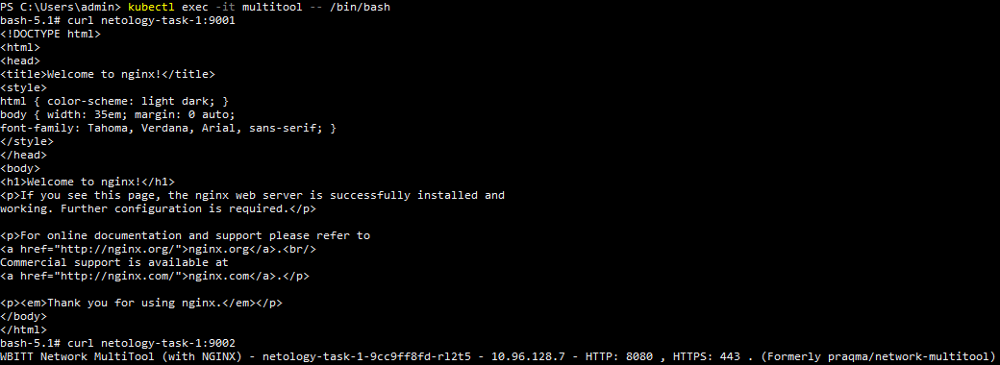
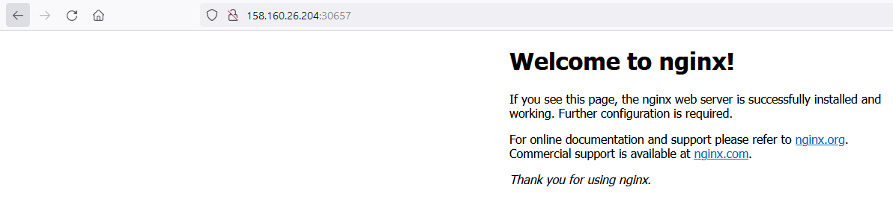

# Домашнее задание к занятию «Сетевое взаимодействие в K8S. Часть 1» Соловьев Д.В.
1. [Манифест файл](./kubernetes%20manifests/deployment%20and%20service.yaml) для деплоймента и сервиса.  
   Запущенные деплоймент, сервис и multitool для проверки:  
     
   Вход в под и выполнение curl:  
     
2. [Манифест файл](./kubernetes%20manifests/nodePort%20service.yaml) для сервиса с nodePort.  
   Запущенный с типом ```NodePort``` сервис:  
     
   Вывод страницы nginx из браузера:  
   